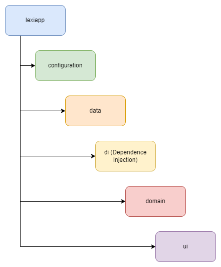

# Lexi App - [Landing Page](https://thelastcolor.github.io/Lexi-Web/)

## Manual técnico
- Descargar el código fuente (rama main)
- Descargar [AndroidStudio](https://developer.android.com/studio) o IDE preferido para desarrollar en Android nativo
- En el tab File -> Open abrir la carpeta donde se descargó el codigo fuente
- Crear cuenta de firebase y seguir los pasos para implementar analytics en el proyecto (google_services.json)
- Generar API-KEYS e incluirlas en el archivo app/src/main/java/com/example/lexiapp/utils/Secrets.kt
- Compilar en AndroidStudio con JDK 11 e instalar en dispositivo o emulador

### Arquitectura
Se implemento una arquitectura MVVM con inyeccion de dependencias con [Dagger-Hilt](https://dagger.dev/hilt/)

     

### Packages
- configuration 
    * Configuración de la base de datos local
- data
    * Modelo de datos de la capa de datos, implementacion de los servicios que interactuan con los gateways o repositories y gateways o repositories
- di (Dependency Injection)
    * Modulos de Dagger-Hilt para la inyeccion de dependencias
- domain
    - model
        - Modelos de datos de la capa de dominio
    - service
        - Interfaces de servicios
    - useCases
        - Casos de uso de las distintas actividades (Lógica de negocio)
- ui
    - Capa de vistas (Fragments, Activities y ViewModels)
